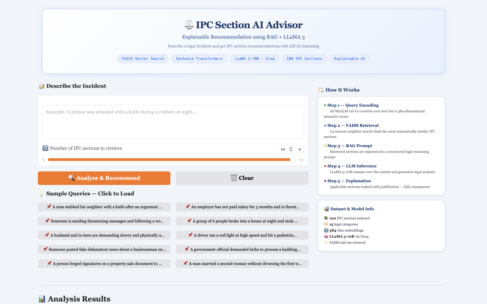
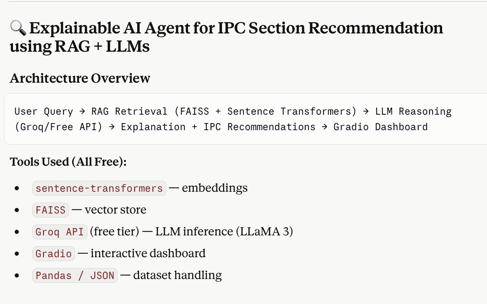
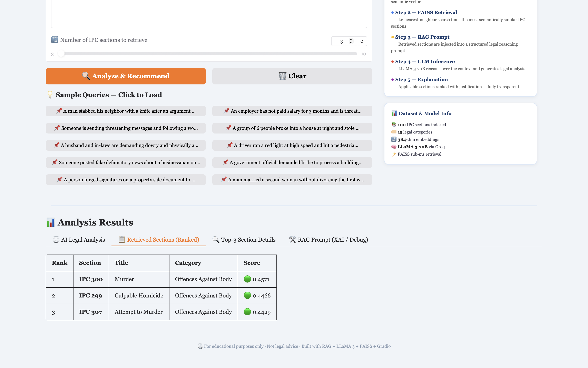

# ⚖️ LegalTech AI Assistant

<p align="center">
  
</p>

<p align="center">
AI-powered Legal Analysis & Recommendation System leveraging Machine Learning, NLP, and Explainable AI to simplify legal understanding and assist intelligent legal decision support.
</p>

<p align="center">
  
  
  
  
  
</p>

---

# 📌 Overview

LegalTech AI Assistant is an intelligent legal analysis platform designed to bridge the gap between complex legal systems and accessible digital assistance. The system combines Natural Language Processing (NLP), Machine Learning, and Explainable AI techniques to analyze legal inputs, generate meaningful recommendations, and present interpretable insights through an interactive dashboard.

The project focuses on improving accessibility, transparency, and efficiency in legal understanding while demonstrating the integration of AI technologies into real-world legal-tech applications.

---

# ✨ Key Features

✅ AI-powered legal analysis
✅ Intelligent recommendation system
✅ Explainable AI-based outputs
✅ Interactive and responsive dashboard
✅ NLP-based text understanding
✅ Structured analytical insights
✅ User-friendly visualization interface
✅ Real-time processing pipeline
✅ Scalable modular architecture

---

# 🏗️ System Architecture

The system follows a modular AI pipeline architecture:

1. User submits legal query or case-related input
2. NLP engine preprocesses and extracts contextual information
3. Machine Learning models analyze legal relevance
4. Recommendation engine generates intelligent outputs
5. Explainable AI layer improves transparency and interpretability
6. Dashboard visualizes analysis and recommendations

---

# 📸 Screenshots

## Architecture Overview

<p align="center">
  
</p>

---

## Dashboard

<p align="center">
  
</p>

---

## Analysis & Recommendation

<p align="center">
  
</p>

---

# 🧠 Explainable AI Component

Unlike traditional black-box AI systems, this platform emphasizes interpretability and transparency. The Explainable AI layer helps users understand how recommendations are generated, improving trust, usability, and legal accountability.

---

# 🔄 Workflow

```text
User Input
    ↓
NLP Processing
    ↓
Context & Feature Extraction
    ↓
Machine Learning Analysis
    ↓
Recommendation Generation
    ↓
Explainable Insights
    ↓
Dashboard Visualization
```

---

# 🛠️ Tech Stack

## Frontend

* HTML
* CSS
* JavaScript

## Backend

* Python
* Flask

## AI / ML

* Machine Learning
* Natural Language Processing (NLP)
* Scikit-learn

## Database

* SQLite

## Tools & Platforms

* Git
* GitHub
* VS Code

---

# ⚙️ Installation

Clone the repository:

```bash
git clone https://github.com/Shambhavii019/LegalTech_IMLDS.git
```

Navigate to project directory:

```bash
cd LegalTech_IMLDS
```

Install dependencies:

```bash
pip install -r requirements.txt
```

Run the application:

```bash
python app.py
```

---

# 🚀 Future Improvements

* Retrieval-Augmented Generation (RAG) integration
* LLM-powered legal reasoning
* Real-time legal document retrieval
* Multi-language legal assistance
* Cloud deployment support
* Voice-enabled legal assistant
* Advanced legal analytics dashboard

---

# 🎯 Project Motivation

Legal systems and documentation are often difficult for common users to interpret and navigate. This project aims to simplify legal understanding using Artificial Intelligence and modern LegalTech solutions by creating an accessible, intelligent, and explainable assistance platform.

---

# 📊 Project Highlights

* Combines AI + LegalTech + Explainable AI
* Focuses on interpretability and accessibility
* Demonstrates practical NLP and ML integration
* Real-world inspired legal assistance workflow
* Designed with scalable modular architecture

---

# 👩‍💻 Contributor

**Shambhavii V. Jaiswal**

---

# 📄 License

This project is developed for educational, research, and innovation purposes.

---

<p align="center">
  <b>⚖️ Transforming Legal Understanding through Artificial Intelligence ⚖️</b>
</p>

